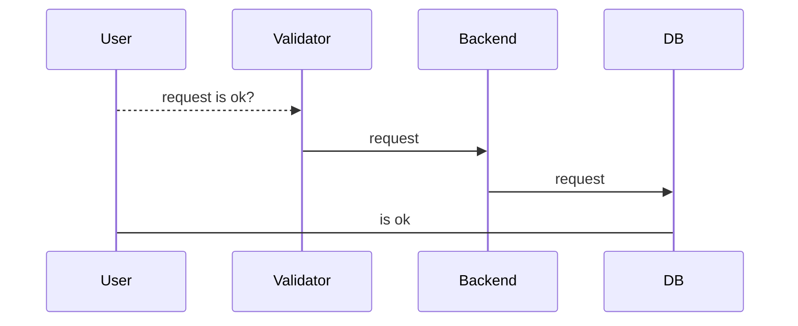
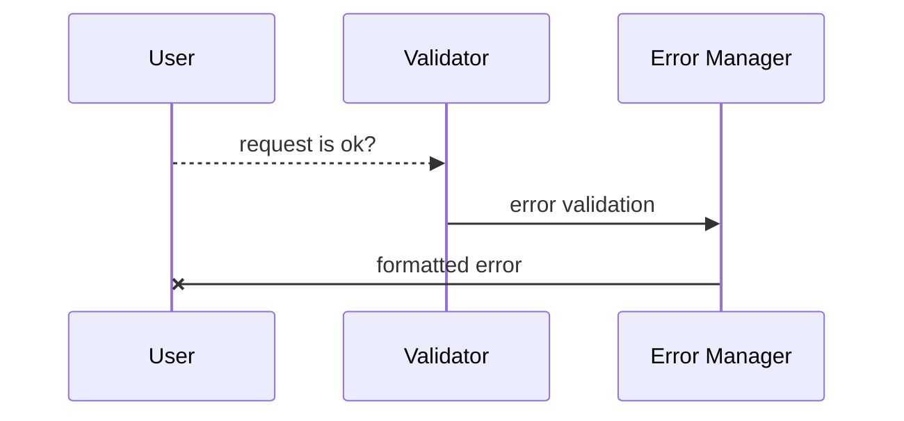
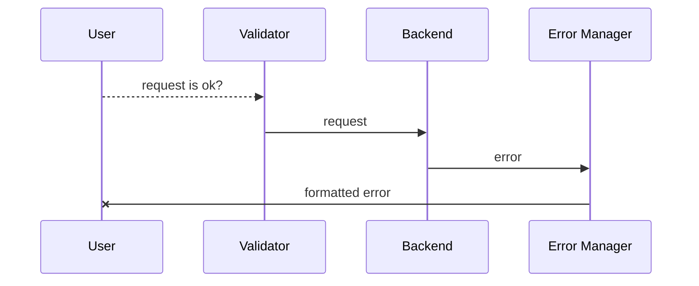
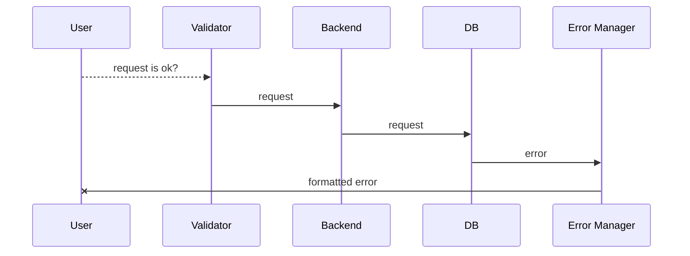
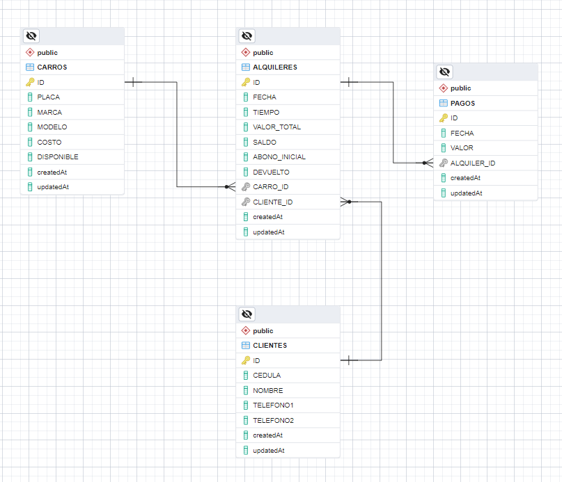
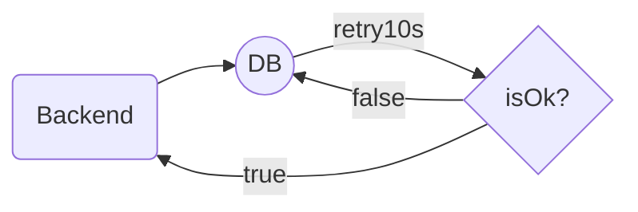

# GSS-Test-Backend

Desarrollo de proyecto para ejercicio de prueba en la empresa GSS, este backend esta desarrollado en **node.js** 18, **Javascript**, implementa **validadores** de datos entrantes, **logger** por consola y por archivo con opcion de integrar servidor de logger, manejo de **errores**, **restriccion de acceso** por lista blanca y para la persistencia de datos se utiliza en servidor de base de datos **postgres** contenedorizado con docker, pero tambien se puede realizar el cambio a **Mysql**, **Sqlite**, **MariaDB** entre otros, con solo modificar la variable de entorno que maneja el tipo de la conexion e instalar el driver del motor de base de datos elegido.


# Rutas

Se implemento un crud por cada base de datos siendo la ruta principal: [http://dominio:puerto/api/v1](http://handlebarsjs.com/), y las rutas de los cruds: **/rents**, **/cars**, **/customers**, **/pays**. 
En cada ruta se implementa un generador de datos aleatorios **/fakegen/:amount** para pruebas y uso de paginacion para consultas paginadas **?limit=#&offset=#**.

## Rents crud

|  Metodo   |    Ruta    |     Descripcion     |
|-----------|------------|---------------------|
|Post| [http://dominio:puerto/api/v1/rents]() | create `{data in body}`|
|Post| [http://dominio:puerto/api/v1/rents/fakegen/:amount]() | create bulk fake data `{amount=# parameter}`|
|Get| [http://dominio:puerto/api/v1/rents]() | read all `{none}`|
|Get| [http://dominio:puerto/api/v1/rents?limit=#&offset=#]() | read paginated `{limit,offset=# parameters}`|
|Get| [http://dominio:puerto/api/v1/rents/:id]() | read one `{id=# parameter}`|
|Put| [http://dominio:puerto/api/v1/rents/:id]() | update `{id=# parameter, data in body}`|
|Delete| [http://dominio:puerto/api/v1/rents/:id]() | delete `{id=# parameter}`|


## Cars crud

|  Metodo   |    Ruta    |     Descripcion     |
|-----------|------------|---------------------|
|Post| [http://dominio:puerto/api/v1/cars]() | create `{data in body}`|
|Post| [http://dominio:puerto/api/v1/cars/fakegen/:amount]() | create bulk fake data `{amount=# parameter}`|
|Get| [http://dominio:puerto/api/v1/cars]() | read all `{none}`|
|Get| [http://dominio:puerto/api/v1/cars?limit=#&offset=#]() | read paginated `{limit,offset=# parameters}`|
|Get| [http://dominio:puerto/api/v1/cars/:id]() | read one `{id=# parameter}`|
|Put| [http://dominio:puerto/api/v1/cars/:id]() | update `{id=# parameter, data in body}`|
|Delete| [http://dominio:puerto/api/v1/cars/:id]() | delete `{id=# parameter}`|


## Pays crud

|  Metodo   |    Ruta    |     Descripcion     |
|-----------|------------|---------------------|
|Post| [http://dominio:puerto/api/v1/pays]() | create `{data in body}`|
|Post| [http://dominio:puerto/api/v1/pays/fakegen/:amount]() | create bulk fake data `{amount=# parameter}`|
|Get| [http://dominio:puerto/api/v1/pays]() | read all `{none}`|
|Get| [http://dominio:puerto/api/v1/pays?limit=#&offset=#]() | read paginated `{limit,offset=# parameters}`|
|Get| [http://dominio:puerto/api/v1/pays/:id]() | read one `{id=# parameter}`|
|Put| [http://dominio:puerto/api/v1/pays/:id]() | update `{id=# parameter, data in body}`|
|Delete| [http://dominio:puerto/api/v1/pays/:id]() | delete `{id=# parameter}`|


## Customers crud

|  Metodo   |    Ruta    |     Descripcion     |
|-----------|------------|---------------------|
|Post| [http://dominio:puerto/api/v1/customers]() | create `{data in body}`|
|Post| [http://dominio:puerto/api/v1/customers/fakegen/:amount]() | create bulk fake data `{amount=# parameter}`|
|Get| [http://dominio:puerto/api/v1/customers]() | read all `{none}`|
|Get| [http://dominio:puerto/api/v1/customers?limit=#&offset=#]() | read paginated `{limit,offset=# parameters}`|
|Get| [http://dominio:puerto/api/v1/customers/:id]() | read one `{id=# parameter}`|
|Put| [http://dominio:puerto/api/v1/customers/:id]() | update `{id=# parameter, data in body}`|
|Delete| [http://dominio:puerto/api/v1/customers/:id]() | delete `{id=# parameter}`|


# Linting

Se utilizó librerias de linting para buenas practicas de desarrollo, como:

- **Eslint**
	> ESLint statically analyzes your code to quickly find problems. It is built into most text editors and you can run ESLint as part of your continuous integration pipeline.

- **Babel**
	> Babel is a toolchain that is mainly used to convert ECMAScript 2015+ code into a backwards compatible version of JavaScript in current and older browsers or environments. Here are the main things Babel can do for you.
- **Prettier**
	> Prettier is an opinionated code formatter with support for: JavaScript (including experimental features), JSX, Angular, Vue, Flow, TypeScript, CSS, Less, and SCSS, HTML, Ember/Handlebars, JSON, GraphQL, Markdown, including GFM and MDX, YAML.


# Manejo de peticiones

Se realiza el manejo de todos los errores, en el procesamiento de las peticiones.

## OK


## Validator error


## Backend error


## DB error



# Data Base

Se utiliza base de datos en postgres con tablas relacionadas entre si, en contenedor docker y contenedor de pgadmin para el manejo grafico de la misma.




## Backup

Se deja backup de la base de datos con informacion de pruebas fake y consultas ejecutadas.

[Backup de  la base de datos](db_backup/backup_db_20230402.sql)


## Sincronizaciones

El ORM implementa la sincronizacion de forma **force** (borra la base de datos en cada inicio), de forma **alter** (intenta realziar cambios en la base de datos si esta difiere del modelo definido) y en forma **silly** en la que solo compara el modelo con la base de datos pero no la modifica, a través de variables.


## Reconexion



## Ejercicios en base de datos

- 1.2
```
SELECT a.*
FROM public."ALQUILERES" a
INNER JOIN public."CARROS" c ON a."CARRO_ID" = c."ID"
WHERE c."PLACA" = '1cju3s' AND a."FECHA" >= '2021-01-21';
```
- 1.3
```
SELECT SUM("SALDO") AS "TOTAL_SALDO"
FROM public."ALQUILERES"
WHERE "FECHA"::date = '2023-01-21'
```
- 1.4
```
SELECT 
    "CLIENTES"."CEDULA",
    "CLIENTES"."NOMBRE",
    "ALQUILERES"."FECHA" AS "FECHA_ALQUILER",
    EXTRACT (DAY FROM (NOW() - "ALQUILERES"."FECHA")) AS "TIEMPO_ALQUILER",
    "ALQUILERES"."SALDO",
    "CARROS"."PLACA",
    "CARROS"."MARCA" 
FROM 
    public."ALQUILERES" 
    INNER JOIN public."CARROS" 
        ON "ALQUILERES"."CARRO_ID" = "CARROS"."ID" 
    INNER JOIN public."CLIENTES" 
        ON "ALQUILERES"."CLIENTE_ID" = "CLIENTES"."ID" 
WHERE 
    "ALQUILERES"."DEVUELTO" = false;
```
- 1.5
```
SELECT 
    "CLIENTES"."CEDULA", 
    "CLIENTES"."NOMBRE"
FROM 
    public."CLIENTES"
WHERE 
    "CLIENTES"."ID" NOT IN (
        SELECT DISTINCT 
            "ALQUILERES"."CLIENTE_ID"
        FROM public."ALQUILERES"
        WHERE 
            "ALQUILERES"."DEVUELTO" = false 
            AND "ALQUILERES"."FECHA" BETWEEN '2021-01-01' AND '2021-03-31');
```
- 1.6
```
SELECT 
    "CLIENTES"."CEDULA", 
    "CLIENTES"."NOMBRE"
FROM 
    public."CLIENTES"
WHERE 
    "CLIENTES"."ID" NOT IN (
        SELECT DISTINCT 
            "ALQUILERES"."CLIENTE_ID"
        FROM public."ALQUILERES"
        WHERE 
            "ALQUILERES"."DEVUELTO" = false 
            AND "ALQUILERES"."FECHA" BETWEEN '2021-01-01' AND '2021-03-31');
```
- 1.7
```
SELECT 
    "CARROS"."ID" AS "CODIGO_CARRO",
    "CARROS"."MODELO",
    "CARROS"."MARCA",
    "CARROS"."COSTO",
    COUNT("ALQUILERES"."ID") AS "CUANTOS_ALQUILERES",
    SUM("ALQUILERES"."VALOR_TOTAL") AS "TOTAL_ALQUILERES"
FROM 
    public."CARROS"
    INNER JOIN public."ALQUILERES" ON "CARROS"."ID" = "ALQUILERES"."CARRO_ID"
WHERE 
    "ALQUILERES"."FECHA" BETWEEN '2022-08-08' AND '2023-01-21'
GROUP BY 
    "CARROS"."ID", 
    "CARROS"."MODELO",
    "CARROS"."MARCA",
    "CARROS"."COSTO";
```
- 1.8
```
SELECT 
    "ALQUILERES"."FECHA",
    "ALQUILERES"."TIEMPO",
    "ALQUILERES"."VALOR_TOTAL",
    "ALQUILERES"."SALDO",
    "ALQUILERES"."ABONO_INICIAL",
    "ALQUILERES"."DEVUELTO",
    "CLIENTES"."NOMBRE",
    "CLIENTES"."CEDULA",
    "CARROS"."MARCA" AS "MARCA_CARRO",
    "CARROS"."MODELO" AS "MODELO_CARRO"
FROM public."ALQUILERES"
    JOIN public."CLIENTES" ON "ALQUILERES"."CLIENTE_ID" = "CLIENTES"."ID"
    JOIN public."CARROS" ON "ALQUILERES"."CARRO_ID" = "CARROS"."ID"
WHERE 
    "ALQUILERES"."CLIENTE_ID" = 3
ORDER BY 
    "ALQUILERES"."FECHA"
LIMIT 1;
```

# Tecnologias usadas

 - [x] JavaScript
 - [x] Nodejs 18.14.0
 - [x] Express.js
 - [x] Joi
 - [x] Sequelize
 - [x] Hapi Boom
 - [x] Winston
 - [x] Cors
 - [x] Jest
 - [x] Eslint
 - [x] Prettier
 - [x] Faker
 - [x] Pg
 - [x] Dotenv


# Responsable

| [<br><sub>JonSteve</sub>](https://github.com/jonstevet) |
| :---: |
